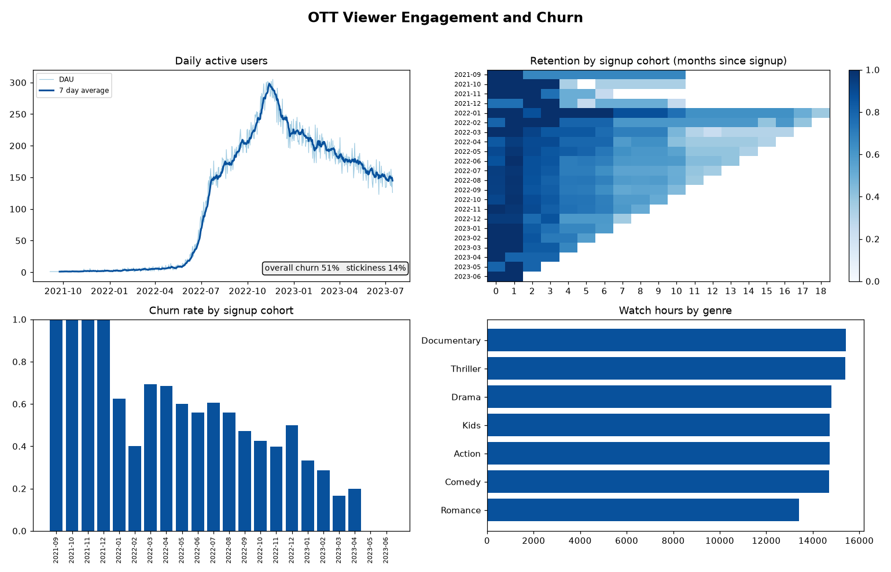

# OTT Viewer Engagement and Churn Analysis

SQL, Python, Pandas and Power BI project on streaming viewer behaviour. It looks
at how much people watch, how often they come back, when they churn, and whether
a simple recommender could nudge engagement. The output is framed the way a
business team would read it: DAU/MAU trends, retention by cohort, churn drivers,
and content performance.

## Dashboard



Generated by `src/charts.py` from the CSVs in `outputs/`. The Power BI build of
the same view is described in `powerbi/README.md`.

## Data

Two layers, and it is worth being clear about which is which.

**Subscribers (real, public).** `data/netflix_userbase.csv` is the "Netflix
Userbase Dataset" by arnavsmayan on Kaggle:
https://www.kaggle.com/datasets/arnavsmayan/netflix-userbase-dataset
2500 subscribers with real subscription type, monthly revenue, join date, last
payment date, country, age, gender and device. It has genuine signup cohorts
(join dates from September 2021 to June 2023) but no viewing activity and no
churn label, since every row is a current subscriber at the mid 2023 snapshot.

**Viewing log (synthetic).** No public dataset pairs individual subscribers
with their per title watch history, so `data/generate_events.py` builds one on
top of the real subscribers: a 300 title catalogue and about 113000 viewing
sessions, each anchored to the subscriber's real join date. Every subscriber
gets a random engagement lifetime, which is what produces the retention curve
and the churn signal. The generator is seeded, so results are reproducible.

See `data/SOURCE.md` for the same note in short form.

## What is in here

```
data/netflix_userbase.csv   the real Kaggle subscriber table
data/generate_events.py     builds titles.csv and events.csv on top of it
sql/engagement.sql          watch time, session frequency, engagement by genre and cohort
src/analysis.py             runs the SQL, cohort and retention analysis, churn, recommender
src/charts.py               renders assets/dashboard.png from the outputs
src/test_analysis.py        sanity checks on the outputs
outputs/                    CSV results, ready for Power BI
powerbi/README.md           how the Power BI dashboard is built
```

## How to run

```
pip install -r requirements.txt
python data/generate_events.py
python src/analysis.py
python src/charts.py
python src/test_analysis.py
```

## What the analysis does

**Engagement (SQL, `sql/engagement.sql`).** Watch hours, session count and
active days per user; the same rolled up by genre and by signup month cohort;
and a daily active users series. `analysis.py` loads the tables into an in
memory SQLite database and runs these queries as is.

**Cohort and retention (`src/analysis.py`).** For each signup month cohort, the
share of users still active N months later. The 2021 and early 2022 cohorts have
only a handful of subscribers each, so read from the mid 2022 cohorts onward:
those hold near 100 percent in month 0, roughly 75 to 85 percent by month 3, and
drop toward 25 to 45 percent by month 12.

**Churn.** A user is marked churned if they have no session in the 30 days
before the snapshot. Overall churn is about 51 percent. It is fairly flat across
plans (Basic 49 percent, Standard 53 percent, Premium 50 percent) and devices
(48 to 53 percent). The most recent cohorts show a low churn rate only because
the 30 day window has not fully passed for them, which is a normal reporting
artifact worth calling out.

**DAU / MAU stickiness.** Daily and monthly active users, and the DAU/MAU ratio
as a stickiness measure. It averages about 14 percent.

**Recommender.** A user by genre watch minutes matrix, cosine similarity between
users, then for each user take the top 10 nearest users, find the genres they
watch most, and recommend the most watched titles in those genres that the user
has not seen. Output is `outputs/recommendations.csv`. It is a baseline to test
the idea, not a production model.

## Outputs

| File | Contents |
|------|----------|
| `user_engagement.csv` | sessions, watch hours, active days per user |
| `genre_engagement.csv` | viewers, sessions and watch hours per genre |
| `cohort_engagement.csv` | watch hours and sessions per user by signup month |
| `dau.csv`, `dau_mau.csv` | daily active users and stickiness |
| `cohort_retention.csv` | retention matrix, cohort by month index |
| `user_churn.csv` | per user churn flag and days since last seen |
| `churn_by_cohort.csv`, `churn_by_plan.csv`, `churn_by_device.csv` | churn rates |
| `recommendations.csv` | top 5 recommended titles per sampled user |

## Notes

The subscriber table is real; the viewing log is synthetic. Treat the watch
time, retention and churn numbers as a demonstration of the method rather than a
finding about Netflix. Swapping in a real events table with the columns
`user_id`, `title_id`, `genre`, `event_date`, `watch_minutes` would let the same
SQL and script run unchanged.
